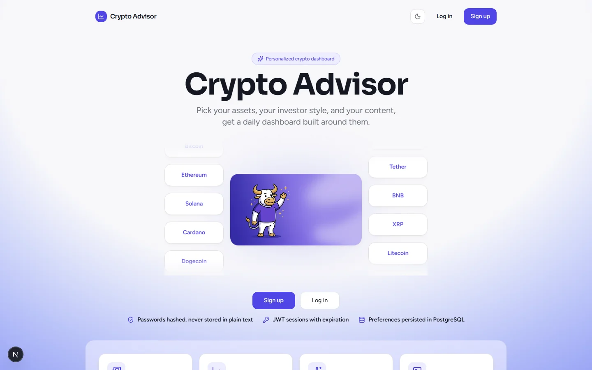
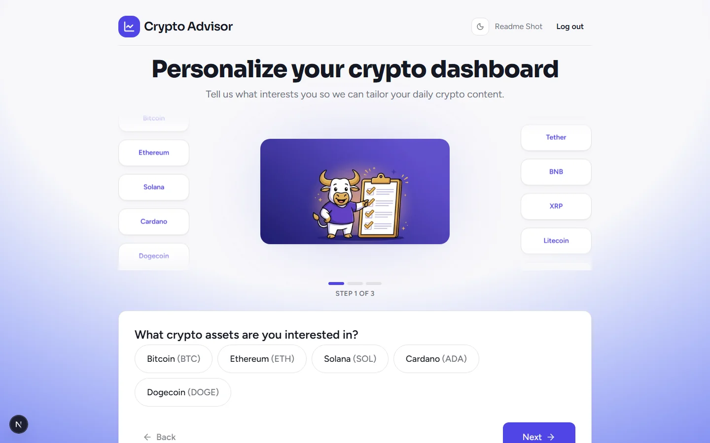
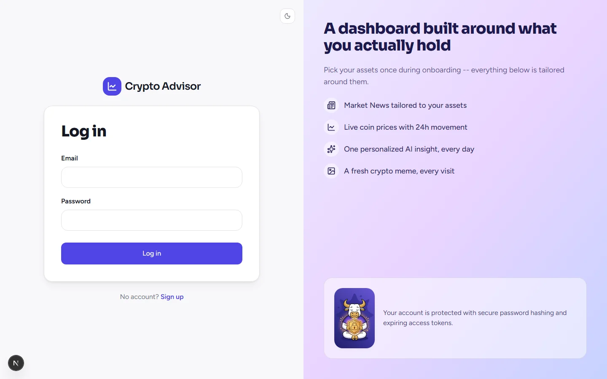
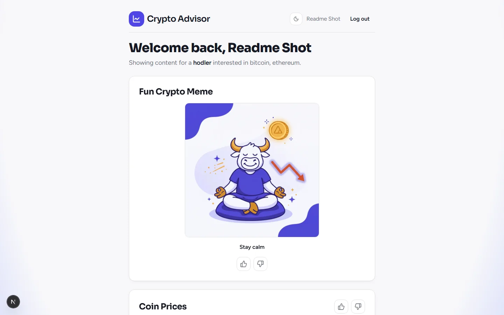

# Crypto Advisor

A personalized crypto-investor dashboard built for the Moveo coding assignment. Users create an account, complete a short onboarding questionnaire, and get a daily dashboard with market news, coin prices, one AI-generated insight per day, and a crypto meme — every section supports thumbs-up / thumbs-down feedback.


> **Status:** deployed and live. Authentication, onboarding (with a dedicated edit-preferences flow), the four dashboard sections, and feedback all work end-to-end against the public URLs, covered by automated tests — see [Deployment](#deployment).

---

## Author

<div align="center">

**Roy Meoded**

Software Developer

[](https://github.com/roy3177)
[](https://www.linkedin.com/in/roy-meoded/)
[](mailto:roymeoded2512@gmail.com)

</div>

---

## Screenshots

| Landing page | Onboarding |
|---|---|
|  |  |

| Login | Dashboard |
|---|---|
|  |  |

## Table of contents

- [Product](#product)
- [Features](#features)
- [Architecture](#architecture)
- [Tech stack](#tech-stack)
- [Repository layout](#repository-layout)
- [Getting started](#getting-started)
- [Environment variables](#environment-variables)
- [Database & migrations](#database--migrations)
- [API reference](#api-reference)
- [Testing](#testing)
- [Deployment](#deployment)
- [Reviewer access to stored data](#reviewer-access-to-stored-data)
- [Known limitations & design decisions](#known-limitations--design-decisions)
- [Financial disclaimer](#financial-disclaimer)

## Product

See [CLAUDE.md](CLAUDE.md) for the full product and engineering rules this project follows, and [Skills/](Skills/) for the detailed design notes behind each feature area.

## Features

- **Accounts** — email/name/password signup, JWT-based login, protected endpoints.
- **Onboarding** — a 3-step questionnaire (crypto assets, investor type, content preferences), saved atomically. The same form doubles as an "Edit preferences" screen afterward, reachable from the dashboard header.
- **Personalized daily dashboard** — four mandatory sections, always present, reordered based on saved preferences:
  - **Market News** — CryptoPanic, with a labeled static fallback when no API key is configured.
  - **Coin Prices** — CoinGecko, scoped to the user's selected assets.
  - **AI Insight of the Day** — one insight per user per day, grounded in real price/news data, generated via OpenRouter with a safe, clearly-labeled fallback.
  - **Fun Crypto Meme** — a randomly served meme from a curated, original set of illustrations.
- **Feedback** — thumbs-up / thumbs-down on every section (and per-article for news), stored per user for future personalization.

## Architecture

```text
Next.js (TypeScript, Tailwind) --HTTPS/REST--> FastAPI --> PostgreSQL
                                                   |
                                                   |-- CoinGecko client (prices)
                                                   |-- CryptoPanic client (news)
                                                   `-- OpenRouter client (AI insight)
```

Backend responsibilities are layered: routes stay thin, business logic lives in a service layer, and each external provider has its own client — see [backend/README.md](backend/README.md) for the full breakdown.

## Tech stack

| Layer | Technology |
|---|---|
| Frontend | Next.js 16, React 19, TypeScript, Tailwind CSS 4 |
| Backend | FastAPI, SQLAlchemy 2, Alembic, Pydantic v2, httpx |
| Database | PostgreSQL |
| Auth | JWT access tokens, bcrypt password hashing |
| Testing | Pytest (backend), Vitest + React Testing Library (frontend) |

## Repository layout

```text
frontend/   Next.js app          -- see frontend/README.md
backend/    FastAPI app          -- see backend/README.md
Skills/     Project-specific Claude Code skills used during development
CLAUDE.md   Full product and engineering rules for this project
```

## Getting started

Requires Node.js, Python 3.11+, and a local PostgreSQL instance.

### Backend

```bash
cd backend
python -m venv venv
./venv/Scripts/activate        # Windows
# source venv/bin/activate     # macOS/Linux
pip install -r requirements.txt
cp .env.example .env
createdb crypto_advisor        # or create it via your Postgres client of choice
alembic upgrade head
uvicorn app.main:app --reload
```

### Frontend

```bash
cd frontend
npm install
cp .env.example .env.local
npm run dev
```

Open http://localhost:3000. Full details for each side live in [backend/README.md](backend/README.md) and [frontend/README.md](frontend/README.md).

## Environment variables

Full lists with descriptions are in `backend/.env.example` and `frontend/.env.example`. Never commit real `.env` / `.env.local` files.

| Variable | Where | Required? |
|---|---|---|
| `DATABASE_URL` | backend | Yes |
| `JWT_SECRET` | backend | Yes |
| `CORS_ORIGINS` | backend | Yes |
| `COINGECKO_API_KEY` | backend | No — keyless demo tier works |
| `CRYPTOPANIC_API_KEY` | backend | No — falls back to static news |
| `OPENROUTER_API_KEY` | backend | No — falls back to a safe static insight |
| `NEXT_PUBLIC_API_URL` | frontend | Yes |

## Database & migrations

Managed with Alembic. The schema defines four tables — `users`, `user_preferences`, `daily_insights`, `content_feedback` — see [Skills/design-database-schema/SKILL.md](Skills/design-database-schema/SKILL.md) for the full design rules and constraints.

```bash
cd backend
alembic upgrade head                                   # apply all migrations
alembic revision --autogenerate -m "describe change"    # after changing a model
```

Always review an autogenerated migration before applying it.

## API reference

All routes are prefixed with `/api` except `/health`. Full request/response schemas are in `backend/app/schemas/`.

| Method | Path | Auth | Description |
|---|---|---|---|
| GET | `/health` | — | Liveness check |
| POST | `/api/auth/signup` | — | Create an account |
| POST | `/api/auth/login` | — | Log in, receive a JWT |
| GET | `/api/auth/me` | ✓ | Current user |
| GET | `/api/preferences/options` | — | Available assets / investor types / content types |
| GET | `/api/preferences/me` | ✓ | Current user's saved preferences |
| PUT | `/api/preferences/me` | ✓ | Save preferences, completes onboarding |
| GET | `/api/market/prices` | ✓ | Prices for the user's selected assets |
| GET | `/api/market/news` | ✓ | Personalized market news |
| GET | `/api/insights/daily` | ✓ | Today's AI insight (generated once, then reused) |
| GET | `/api/memes/random` | — | A random crypto meme |
| PUT | `/api/feedback` | ✓ | Upsert a thumbs-up/down vote |
| GET | `/api/feedback/me` | ✓ | Current user's saved votes |

## Testing

Backend:

```bash
cd backend
./venv/Scripts/pytest   # Windows
# pytest                # macOS/Linux
```

Covers database constraints, authentication, onboarding, the CoinGecko/CryptoPanic integrations (provider error handling, cache, fallback), the daily AI insight (grounding, prompt-injection containment, daily reuse), the meme endpoint, and feedback (upsert, ownership, cross-user isolation). Tests that need a real database are skipped automatically if `DATABASE_URL` isn't reachable; provider-client tests never touch a live network.

Frontend:

```bash
cd frontend
npm test
```

Covers the auth forms, `ProtectedRoute`, the onboarding questionnaire, the dashboard's four sections (loading, partial failure, fallback labeling, personalization-driven ordering), and the reusable feedback buttons.

Production build:

```bash
cd frontend
npm run build
```

## Deployment

Live: frontend on Vercel, backend + managed PostgreSQL on Render — see [Skills/deploy-crypto-advisor/SKILL.md](Skills/deploy-crypto-advisor/SKILL.md) for the full process.

- **App:** https://ai-crypto-advisor-i8oe.vercel.app
- **API:** https://ai-crypto-advisor-9lnf.onrender.com (`/health` for a liveness check)

**Known free-tier limitation:** the backend is on Render's free plan, which spins down after inactivity — the first request after a while can take up to ~50 seconds while it wakes up. Subsequent requests are fast.

## Reviewer access to stored data

For a reviewer to inspect stored data without production credentials:

- **Local:** follow [Getting started](#getting-started), then inspect the database directly with `psql` or any Postgres client (`SELECT * FROM users;`, `SELECT * FROM content_feedback;`, etc.) — no data is hidden or write-protected for the local database owner.
- **Production:** on request, a temporary read-only database user (or a screen-share of Render's built-in Postgres dashboard) will be shared with reviewers directly — never committed to the repository, and never the primary application credentials.

## Known limitations & design decisions

- No password-reset or email-verification flow. Editing saved preferences later is supported — the onboarding form doubles as an edit screen, reachable via "Edit preferences" in the dashboard header once onboarding is complete.
- **Feedback content keys:** market news is voted per-article; coin prices, the AI insight, and the meme are voted as a whole section, not per sub-element. A fallback AI insight has no feedback controls, since it was never saved.
- **Meme images and site-wide illustrations** are original Google Gemini generations made for this project (`frontend/public/memes/`, `frontend/public/illustrations/`) — not scraped, hotlinked, or using any real coin/brand logos. Source exports live in `frontend/images/` (git-ignored).
- **Dashboard personalization:** section order responds to the user's saved `content_types` (`charts` → Coin Prices earlier, `market_news` → Market News earlier). The meme is deliberately never moved to the front regardless of preference — it stays a lighthearted closing note at the end — verified with both unit and rendered-DOM tests.
- **Security hardening:** the backend refuses to start in production with the default JWT secret (fails loudly instead of booting insecurely), and login/signup are rate-limited per IP (10 attempts / 5 min, 5 signups / hour) to blunt brute-force and account-spam attempts.
- **AI insight generation** was verified live against a real OpenRouter account for the full error path (a model that moved to the paid tier caught via a live `404`, then a live `429` rate limit correctly triggering the safe fallback). A fully successful live generation (prompt → real model output → stored insight) is covered by mocked tests only — worth retrying after adding OpenRouter credits.
- **CryptoPanic news** requires a free API key from https://cryptopanic.com/developers/api/; without one, the app runs correctly on labeled static fallback news.
- **In-memory cache:** prices (60s) and news (5min) are cached in the backend process's memory only — fine for a single-instance deployment, would need a shared cache (e.g. Redis) for a multi-instance one.
- **Auth token storage:** the JWT lives in `localStorage`, attached via the centralized API client — simple and standard for an MVP, though it means an XSS vulnerability could read the token (an `HttpOnly` cookie would trade that risk for needing CSRF protection).

## Financial disclaimer

This application is for informational purposes only and does not provide financial advice.
